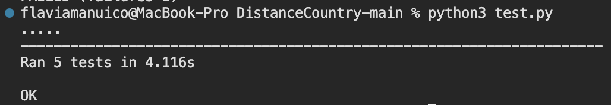

# DistanceCountry
Tarea Ingeniería de Software

Integrantes:
- Yamileth Rincón
- Flavia Mañuico


Se usa flask <br>
```
pip install flask
pip install requests
```
- Para correr el archivo de distancias y su consola en terminal:
```py
python3 tarea.py
```

- Para correr los test, utilizar:
```py
python3 test.py
```
### Resultados de Test:


## Test Steps

### Test Data

- En la presente mostramos como ejemplos paises que existen y que no para realizar la prueba y error de calcular sus distancias, además obtenemos las coordenadas Mock y API.
```py
def setUp(self):
        self.ciudad_existente1 = Ciudad("Lima", "Peru")
        self.ciudad_existente2 = Ciudad("Buenos Aires", "Argentina")
        self.ciudad_inexistente = Ciudad("CiudadNoExistente", "PaisNoExistente")
        self.ciudad_repetida = Ciudad("Lima", "Peru")
        
        self.obtenerCoordenadasMock = ObtenerCoordenadasMock()
        self.obtenerCoordenadasAPI = ObtenerCoordenadasAPI()
```
- En caso de no exista la ciudad se espera que se guarde valor 0.00 tanto en longitud como como en latitud de la ciudad.
```py
def test_ciudad_inexistente_API(self):
    coord = self.obtenerCoordenadasAPI.obtener(self.ciudad_inexistente)
    self.assertEqual(coord.latitud, 0.0)
    self.assertEqual(coord.longitud, 0.0)
```


### Test Expect Result

#### Distancias Mock
Obtenemos las distancias con Mock, distancia definida y comprobamos que sean cero ya que si existen la distancia de ambas ciudades, sería la misma y en caso de que sea la ciudad repetida de igual forma tienen la misma distancia por lo cual en ambos casos se espera una distancia de 0.00
```py
def test_distancia_ciudades_existentes_MOCK(self):
        coord1 = self.obtenerCoordenadasMock.obtener(self.ciudad_existente1)
        coord2 = self.obtenerCoordenadasMock.obtener(self.ciudad_existente2)
        distancia = calcular_distancia(coord1, coord2)
        self.assertAlmostEqual(distancia, 0.0)

def test_ciudad_repetida_MOCK(self):
    coord1 = self.obtenerCoordenadasMock.obtener(self.ciudad_existente1)
    coord2 = self.obtenerCoordenadasMock.obtener(self.ciudad_repetida)
    distancia = calcular_distancia(coord1, coord2)
    self.assertAlmostEqual(distancia, 0.0)
```

#### Distancias API
En este caso realizamos dos test para calcular las distancias:

1. Distancia entre ciudades exitentes las cuales son Perú y Buenos Aires, donde se espera una distancia aproximada de 3120.0 km 
```py
def test_distancia_ciudades_existentes_API(self):
    coord1 = self.obtenerCoordenadasAPI.obtener(self.ciudad_existente1)
    coord2 = self.obtenerCoordenadasAPI.obtener(self.ciudad_existente2)
    distancia = calcular_distancia(coord1, coord2)
    # Distancia aprox entre Lima y Buenos Aires
    self.assertAlmostEqual(distancia, 3120.0, delta=100.0)
```
2. Distancia entre la ciudad repetida, en este caso Lima en el cual se espera una distancia de 0.00 ya que es la ubicación de la misma ciudad.
```py
def test_ciudad_repetida_API(self):
    coord1 = self.obtenerCoordenadasAPI.obtener(self.ciudad_existente1)
    coord2 = self.obtenerCoordenadasAPI.obtener(self.ciudad_repetida)
    distancia = calcular_distancia(coord1, coord2)
    self.assertAlmostEqual(distancia, 0.0)
```

